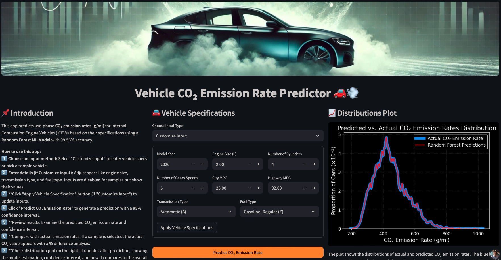

# CO₂ Emissions Prediction  

This repository contains the **Streamlit app** and **Jupyter Notebook** for predicting use-phase CO₂ emission rates (aka, emission intensities/ factors) from internal combustion engine vehicles (ICEVs).  

## 🚀 Key Features  
- **Machine learning models** (Random Forest, Polynomial Ridge, and others) for CO₂ emission rate predictions  
- **Data preprocessing, feature engineering, and model evaluation**  
- **Interactive Streamlit web app** for real-time predictions  
- **Exploratory Data Analysis (EDA)** and residual analysis  
- **Deployment-ready code** with trained model files  

## 📂 Repository Structure  
### 🖥️ Code & Model  
- **`CO2_Emission_Prediction.ipynb`** → Jupyter Notebook with full data analysis and model training  
- **`co2_pred.py`** → Streamlit app code for real-time predictions  
- **`random_forest_compressed.pkl`** → Compressed trained model for deployment  
- **`feature_columns.pkl`** → Saved feature list for consistent input processing  

### 📊 Data Files  
- **`data/sample_data.csv`** → Sample input data for predictions  
- **`data/sample_CO2.csv`** → Sample CO₂ emission rates data  
- **`data/actual_rf.csv`** → Actual CO₂ emission rate values for distribution plot  
- **`data/predicted_rf.csv`** → Predicted CO₂ emission rate values for distribution plot  
- **`data/residuals_rf.csv`** → Model residuals for calculating 95% confidence intervals  

---

## 🌐 Live App  
📢 **Check out the app and share your feedback!**  
**[🔗 View Live Streamlit App](https://co2emissionsprediction.streamlit.app/)**  

✉️ Feel free to reach out if you have any questions or suggestions!  
